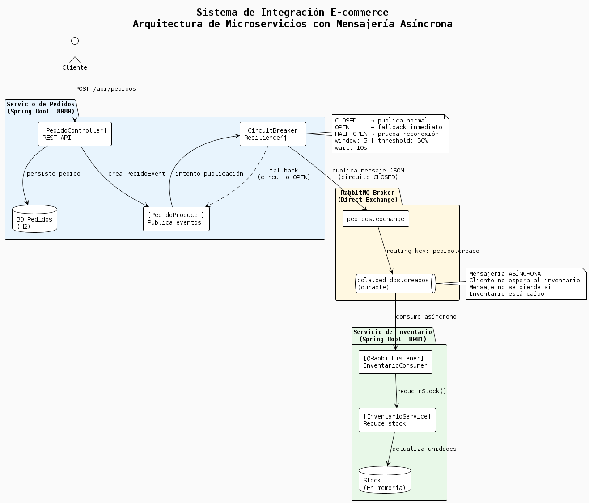

# Sistema de Integración E-commerce
Arquitectura de microservicios con mensajería asíncrona usando RabbitMQ y Circuit Breaker.
Link: https://share.note.sx/0m80jo04#+Lk+SpVBO8cijFKl/mciAQ6Jarjo5/MZBJnLprSjDLI

## Tecnologías
- Java 17
- Spring Boot 3.5.14
- RabbitMQ 3.13
- Resilience4j (Circuit Breaker)
- Docker

## Requisitos previos
- Java 17+
- Maven
- Docker Desktop

## 1. Levantar RabbitMQ
Antes de correr cualquier servicio, levanta RabbitMQ con Docker:

```bash
docker run -d --name rabbitmq -p 5672:5672 -p 15672:15672 rabbitmq:3-management
```

Verifica que esté corriendo en:
**http://localhost:15672**
- Usuario: `guest`
- Contraseña: `guest`

## 2. Correr los servicios
Corre ambos servicios desde IntelliJ o con Maven:

### Servicio de Pedidos (puerto 8080)
```bash
cd servicio-pedidos
./mvnw spring-boot:run
```

### Servicio de Inventario (puerto 8081)
```bash
cd servicio-inventario
./mvnw spring-boot:run
```

## 3. Probar el sistema
Desde Postman o cualquier cliente REST:

```bash
POST http://localhost:8080/api/pedidos
Content-Type: application/json

{
    "productoId": "PROD-001",
    "cantidad": 5
}
```

Respuesta esperada:
```json
{
    "estado": "PENDIENTE",
    "pedidoId": 1,
    "mensaje": "Pedido creado. Inventario se actualizará de forma asíncrona."
}
```

## 4. Probar el Circuit Breaker
Para simular la caída de RabbitMQ:

```bash
docker stop rabbitmq
```

Haz varios POST en Postman y verás en el log:

> [CIRCUIT BREAKER] ⚠️ Circuito ABIERTO. No se pudo publicar evento...

Para recuperar el sistema:
```bash
docker start rabbitmq
```

El sistema se reconecta automáticamente sin reiniciar nada.

## Arquitectura
Cliente → Servicio de Pedidos → RabbitMQ → Servicio de Inventario
↑
Circuit Breaker
(Resilience4j)



## Servicios
| Servicio | Puerto | Descripción |
|---|---|---|
| servicio-pedidos | 8080 | Recibe pedidos y publica eventos |
| servicio-inventario | 8081 | Consume eventos y actualiza stock |
| RabbitMQ Management | 15672 | Panel de administración |
